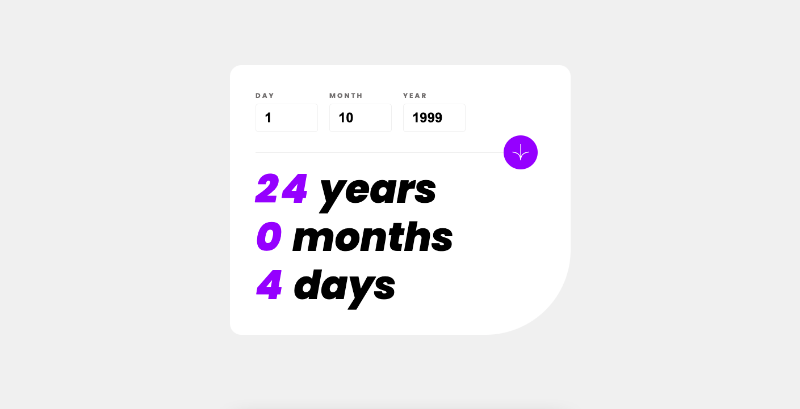

# Frontend Mentor - Age calculator app

This is a solution to the [Age calculator app challenge on Frontend Mentor](https://www.frontendmentor.io/challenges/age-calculator-app-dF9DFFpj-Q/). Frontend Mentor challenges help you improve your coding skills by building realistic projects.

## Table of contents

- [Overview](#overview)
  - [Screenshot](#screenshot)
  - [Links](#links)
- [My process](#my-process)
  - [Built with](#built-with)
  - [What I learned](#what-i-learned)
- [Author](#author)

## Overview

### Screenshot

### Links

- Solution URL: [Add solution URL here](https://github.com/anaislcno/Age-Calculator-App)

## My process

### Built with

- Semantic HTML5 markup
- CSS custom properties
- Flex & Grid
- JavaScript functions

### What I learned

I've done this challenge because I want to improve my skills in pure HTMM, CSS and overall JavaScript.

## Author

- Website - [Anais Lemire](https://anaislemire.vercel.app/)
- Frontend Mentor - [@anaislcno](https://www.frontendmentor.io/profile/anaislcno)
